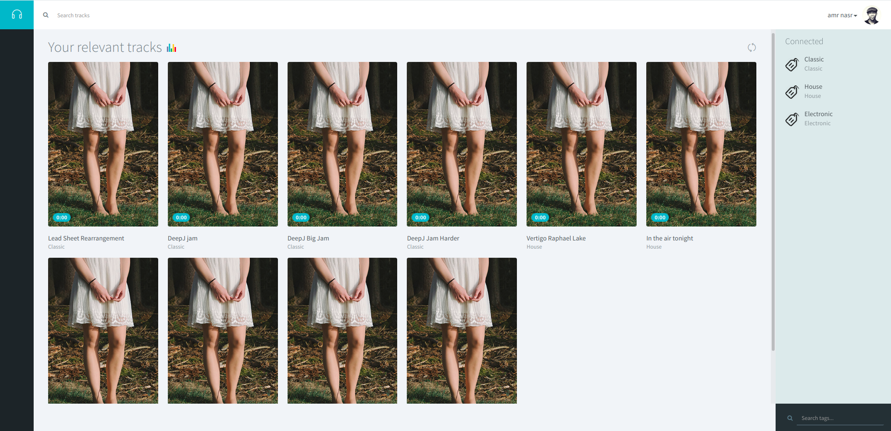
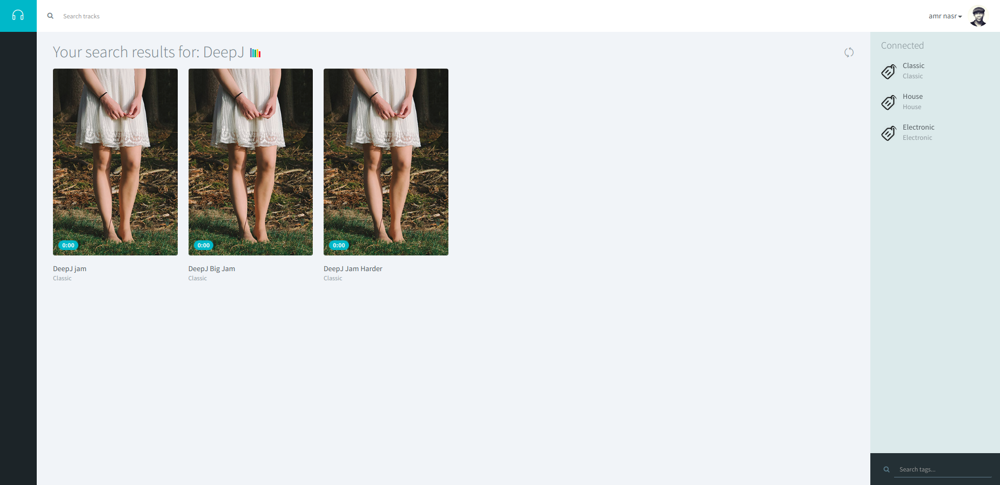
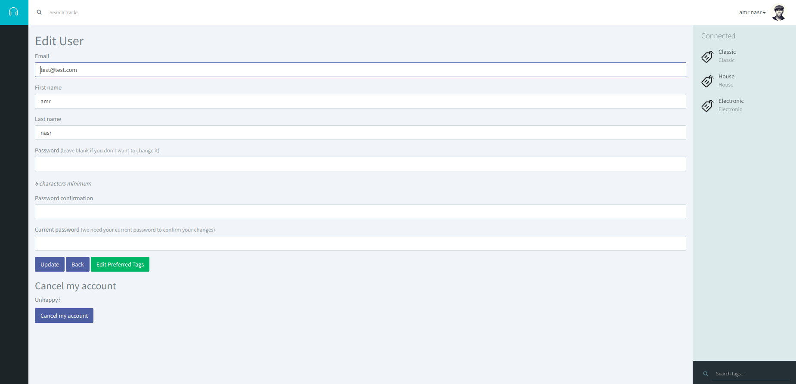
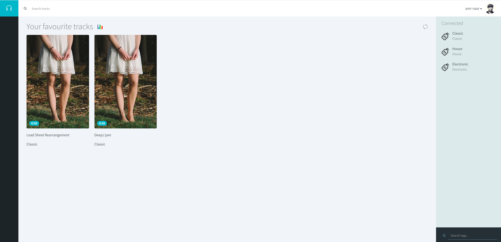
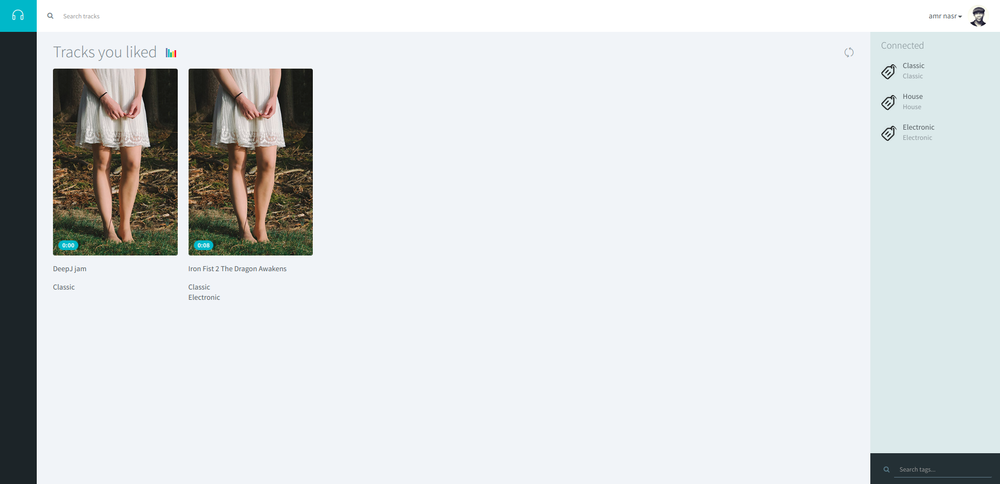
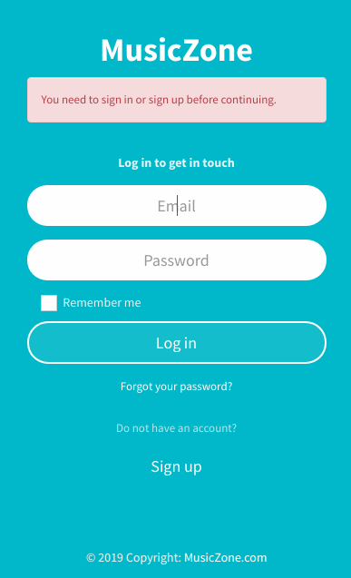
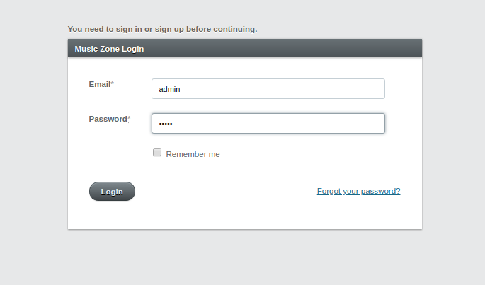
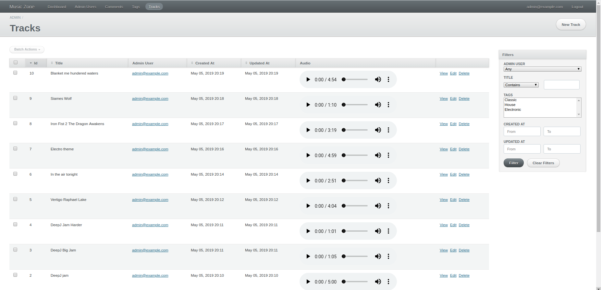

# Music Zone: An Online Virtual Music Listening Platform

## Overview
A website project proposed in the software engineering course to be done in a series of sprints. It was done in ruby on rails and was developed using test-driven development.

---
## Features
* Supports user and admin roles.
* User login and registration.
* Admins can add music tracks(mp3 format), edit music tracks information, delete tracks from system, play the tracks and tag tracks.
* Users can choose favourite tags to be shown to him on homepage, can edit information, search by title or tag, play music, like or add track to favorites. 
---
## Sample Runs

---